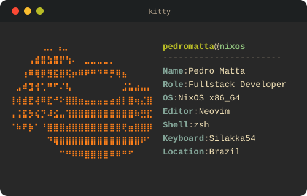

    

    <table>
        <tr>
            <td colspan="2">
                 
                

                    
                    &nbsp;&nbsp;
                    
                

                 
                
                  
            </td>
        </tr>
    </table>
    <table>
        <tr>
            <td>
                 
                
<b>Tech Stack</b>

                

                    
                    
                    
                    
                    
                    
                     
                    
                    
                    
                    
                    
                    
                

            </td>
        </tr>
    </table>

